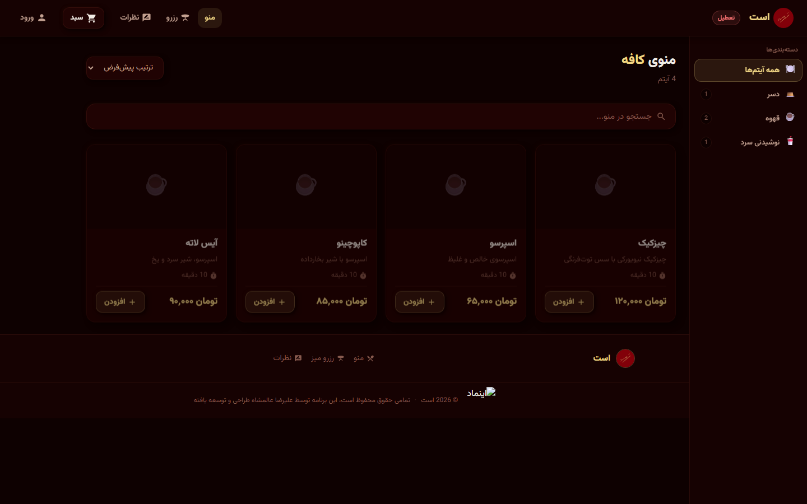

# Rose Cafe

Full-stack ordering & management platform for a café — online menu, cart, table reservations, and delivery, backed by a Django REST API and a React frontend. Verified working by running the app locally end-to-end.

**[English](#english) | [فارسی](#فارسی)**

---

## English

### Screenshot



### About

Rose Cafe is a complete café ordering system with two sides: a customer-facing storefront (menu browsing, cart, checkout, table reservations, reviews, profile) and an admin/waiter back office (orders, payments, menu, categories, tables). Customer accounts authenticate via phone number + SMS one-time code instead of a password.

### Tech Stack

**Backend** (`backend/`)
- Django 4 + Django REST Framework, split settings (`config/settings/{base,dev,prod}.py`)
- JWT auth (`djangorestframework-simplejwt`) with phone/OTP login via Melipayamak SMS
- PostgreSQL, Redis (cache) + Celery + `django-celery-beat`/`-results` for background/scheduled jobs
- `drf-spectacular` for OpenAPI schema/docs
- `django-phonenumber-field`, `jdatetime` (Jalali calendar), `django-dbbackup`

**Frontend** (`frontend/`)
- React + Vite, React Router
- Zustand for state management
- Axios (with an auth-refresh interceptor in `src/api/axios.js`), React Hot Toast
- Vazirmatn variable font (self-hosted)

### App structure (verified by running it)

Backend apps: `accounts`, `menu`, `orders`, `payments`, `reservations`, `reviews`, `discounts`, `notifications`, plus `business` for site-wide settings (banners, delivery pricing, social links, waiter permissions).

Frontend routes (`src/App.jsx`): `/login`, `/register`, `/` (menu, public), `/menu/:slug`, `/cart`, `/orders`, `/reservations`, `/payment`, `/reviews`, `/profile` (protected), and a separate `/admin/*` area (dashboard, orders, payments, menu, categories, tables).

### Getting Started

```bash
# Backend
cd backend
cp .env.example .env   # SECRET_KEY, DATABASE_URL, SMS provider token, Redis URL
pip install -r requirements.txt
python manage.py migrate
python manage.py runserver

# Frontend
cd frontend
npm install
npm run dev
```

The API root is namespaced under `/api/{auth,menu,orders,payments,reservations,reviews,discounts,business,notifications}/`.

### Known issue found while testing

`backend/config/settings/dev.py` has a **hardcoded local database password** committed to git history. It should be read from an environment variable instead, and the password should be rotated if it's been reused anywhere else.

---

## فارسی

### تصویر


### درباره

رز کافه یک سیستم کامل سفارش‌گیری کافه با دو بخش است: ویترین مشتری (مرور منو، سبد خرید، پرداخت، رزرو میز، نظرات، پروفایل) و بخش مدیریتی/گارسون (سفارش‌ها، پرداخت‌ها، منو، دسته‌بندی‌ها، میزها). ورود مشتریان با شماره موبایل و کد یک‌بارمصرف پیامکی انجام می‌شود، نه رمز عبور.

### پشته فناوری

**بک‌اند** (`backend/`)
- Django 4 + DRF، تنظیمات تفکیک‌شده (`config/settings/{base,dev,prod}.py`)
- احراز هویت JWT با ورود شماره موبایل/کد یک‌بارمصرف از طریق ملی‌پیامک
- PostgreSQL، Redis (کش) + Celery و `django-celery-beat`/`-results` برای وظایف پس‌زمینه/زمان‌بندی‌شده
- مستندسازی API با `drf-spectacular`
- `django-phonenumber-field`، `jdatetime` (تقویم شمسی)، `django-dbbackup`

**فرانت‌اند** (`frontend/`)
- React + Vite، React Router
- مدیریت state با Zustand
- Axios (با interceptor تمدید خودکار توکن در `src/api/axios.js`)، React Hot Toast
- فونت وزیرمتن (self-hosted)

### ساختار اپلیکیشن (تأیید‌شده با اجرای واقعی)

اپ‌های بک‌اند: `accounts`، `menu`، `orders`، `payments`، `reservations`، `reviews`، `discounts`، `notifications`، به‌علاوه `business` برای تنظیمات کلی سایت (بنرها، هزینه ارسال، شبکه‌های اجتماعی، دسترسی گارسون‌ها).

مسیرهای فرانت‌اند: `/login`، `/register`، `/` (منو، عمومی)، `/menu/:slug`، `/cart`، `/orders`، `/reservations`، `/payment`، `/reviews`، `/profile` (نیازمند ورود)، و بخش جدای `/admin/*`.

### راه‌اندازی

```bash
# بک‌اند
cd backend
cp .env.example .env
pip install -r requirements.txt
python manage.py migrate
python manage.py runserver

# فرانت‌اند
cd frontend
npm install
npm run dev
```

### مشکل پیدا‌شده حین تست

فایل `backend/config/settings/dev.py` شامل یک **پسورد دیتابیس هاردکد‌شده** در تاریخچه‌ی گیت است. بهتر است از متغیر محیطی خوانده شود و اگر این پسورد جای دیگری هم استفاده شده، عوض شود.
